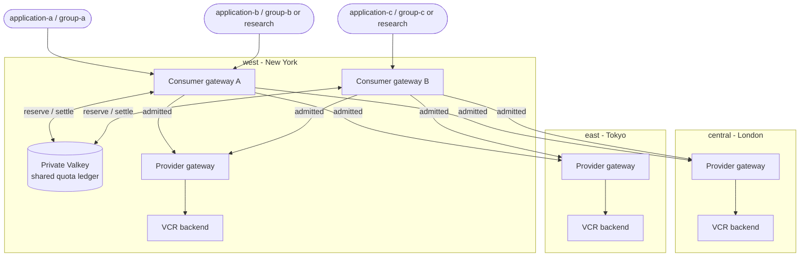
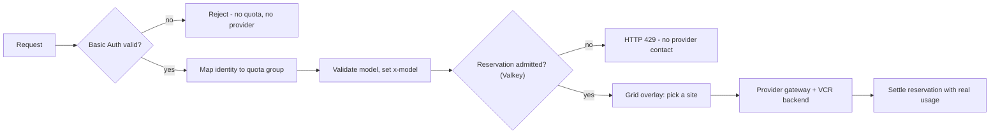
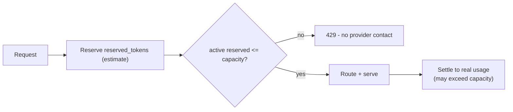

# Grid Distributed Quota Demo

Several applications share one pool of regional inference providers behind Praxis
consumer gateways, while a **distributed, identity-scoped token budget** decides
who may spend and Grid decides where each admitted request runs. The budget lives
in one cluster-private Valkey ledger, so it follows an application's *identity* -
not the gateway it happened to enter through, and not the region that serves it.

Three Kind clusters, `model=Qwen/Qwen3-0.6B`, colocated consumer + provider
roles, one shared quota ledger.

> **Status - not yet runnable from released artifacts.** This demo packages a
> cross-repository feature that is **not merged yet**. It depends on:
>
> 1. **Praxis** filters `identity_projection` and `trusted_quota_group` (new;
>    not in the released Praxis dependency of `ghcr.io/praxis-proxy/ai:0.3.0`).
> 2. A **Praxis AI** gateway image built to include those filters *plus*
>    `token-rate-limit-filter` and `praxis-filter/basic-auth-filter`.
> 3. The **Grid** `run-grid-token-rate-limit-qualification` three-application
>    runner (not on Grid `main` yet).
>
> Until those land upstream, `run.sh` cannot bring this demo up from clean
> checkouts or the published rollup. Merge order is Praxis -> AI -> Grid; then
> rebase this demo, pin the exact prerequisite versions/SHAs below, and run it
> from clean upstream checkouts before opening a PR.

## Topology



City names are illustrative aliases for the `west`, `central`, and `east` test
sites.

## Two planes, cleanly separated

The demo's whole point is that **quota** and **routing** are independent:



- **Valkey answers _may I spend tokens?_** - the shared quota ledger.
- **Grid answers _which provider serves this admitted request?_** - the routing
  overlay (`roundRobin`, `noMetrics` scoring).

Neither provider identity nor region participates in the quota key, so rotating
regions never creates fresh budget.

## The quota contract: a reservation cap

A token limiter cannot know a request's real cost until the model has answered.
So it **reserves** an estimate up front to admit, then **settles** to actual
usage afterward.



- **Enforced invariant:** active reserved tokens never exceed capacity.
- **Settlement is an observation, not a second cap.** If a request used more than
  it reserved, settled usage can legitimately exceed capacity. That is correct
  accounting, not over-admission.

Each rule uses `capacity: 60`, `reserved_tokens: 15`. The per-application rules
use a `60s` window; the shared research rule uses a longer `300s` window so its
multi-request measurement fits inside one window - the semantics and the cap are
identical.

## Applications and identities

Basic Auth admits three application principals; the identity gateway
(`identity_projection`) maps each to a quota group header, and the consumer
(`trusted_quota_group`) trusts that header to select a rule.

| Application | Basic Auth username | Quota group | Independent rule | Under the shared-research policy |
|---|---|---|---|---|
| A | `application-a` | `group-a` | `quota-group-a` | `quota-group-a` (unchanged) |
| B | `application-b` | `group-b` | `quota-group-b` | `quota-research` (shared with C) |
| C | `application-c` | `group-c` | `quota-group-c` | `quota-research` (shared with B) |

---

## User stories

Each story is a real thing a platform team cares about, the capability it
exercises, and what you will see in the run.

### 1. "A budget follows the identity, not the front door"
**As** an operator running two consumer gateways for high availability, **I want**
an application's token budget enforced no matter which gateway serves the request,
**so that** horizontal scaling never multiplies anyone's quota.

> **What you'll see:** application-a's requests through gateway A and gateway B
> draw from the *same* Valkey ledger. Once its budget is spent, the second gateway
> returns `429` too - scaling out gateways did not mint new capacity.
> _(scenario: `shared_budget_and_distribution`)_

### 2. "Three applications, three budgets, no collateral damage"
**As** a platform team hosting multiple applications on shared infrastructure,
**I want** each application's quota isolated, **so that** one noisy application
cannot throttle another.

> **What you'll see:** applications A, B, and C each hit their own rule. Driving A
> to exhaustion leaves B and C fully admitted, and vice-versa. Isolation is by
> identity, not by luck.
> _(scenario: `three_application_independent_quota_isolation`)_

### 3. "A shared research pool for two applications"
**As** an operator funding a joint effort, **I want** to deliberately charge two
distinct identities to one shared budget while a third stays independent, **so
that** collaborators share a pool without a new per-user mechanism.

> **What you'll see:** with the shared-research policy applied, B and C both map to
> `quota-research`. Exhausting the pool through B alone causes C to be denied with
> no traffic of its own - proof they share one ledger - while A is still admitted.
> Sharing is proven from the reservation ledger, never from a variable
> settled-usage boundary.
> _(scenario: `three_application_shared_research_quota`)_

### 4. "Fair routing across regions, without minting capacity"
**As** an operator with providers in several regions, **I want** admitted traffic
spread across every healthy site while the budget stays fixed, **so that** load
balancing and quota never interfere.

> **What you'll see:** admitted requests rotate across New York, London, and Tokyo
> (all three sites appear in the distribution), yet changing the serving region
> never changes the quota key or grants extra tokens.
> _(scenarios: `shared_budget_and_distribution`, `valid_auth`)_

### 5. "The budget survives a restart and recovers on its own"
**As** an operator performing rolling updates, **I want** quota state to survive a
gateway restart and capacity to return only through real time passing, **so that**
neither a restart nor a clock trick resets anyone's budget.

> **What you'll see:** after exhausting the budget, restarting a consumer leaves
> the ledger intact (`429` still returned, quota entries unchanged). Capacity then
> returns purely as the sliding window ages out - the demo never flushes Valkey to
> fake recovery.
> _(scenarios: `restart_persistence`, `window_expiry_recovery`)_

### 6. "Admit on an estimate, reconcile on the truth - safely"
**As** an operator, **I want** admission to hold a hard reservation cap under
concurrency and never leak a denied request to a provider, **so that** the limit
is trustworthy even when real usage overshoots the estimate.

> **What you'll see:** a concurrent burst admits exactly the reservation cap (peak
> reserved tokens stay at or below capacity) and denies the rest - and every
> denied request stops at the gateway with no provider contact. Settled usage may
> exceed capacity and is recorded as evidence, not treated as a failure.
> _(scenario: `concurrency_no_over_admission`)_

### 7. "Fail safe, and keep the ledger locked down"
**As** a security-minded operator, **I want** the limiter to fail closed if its
backing store is unreachable, and the store reachable only by authorized pods,
**so that** an outage cannot silently disable enforcement and nothing else can
read the ledger.

> **What you'll see:** during a Valkey outage the limiter returns `503`
> (fail-closed), then recovers when Valkey returns. A pod without the quota-client
> label cannot reach Valkey at all, while a permitted consumer can.
> _(scenarios: `valkey_outage_fail_closed`, `network_policy_denies_unauthorized`)_

---

## What it demonstrates

Once the prerequisites above are in place, a run proves:

- One shared, identity-scoped token budget across horizontally scaled gateways.
- Independent per-application quotas plus a deliberately shared research pool.
- A reservation cap that holds under concurrency, with settlement recorded as
  evidence rather than mistaken for over-admission.
- Denied requests never reach a provider; unauthorized pods never reach Valkey.
- Quota that survives restarts and recovers only through natural window aging.
- Grid round-robin provider selection across three regions, fully decoupled from
  the quota decision.

## Prerequisites

- A local [praxis-proxy/grid](https://github.com/praxis-proxy/grid) checkout (or
  set `GRID_REPO`) containing the `run-grid-token-rate-limit-qualification`
  three-application runner.
- A local [praxis-proxy/ai](https://github.com/praxis-proxy/ai) checkout **whose
  Praxis dependency includes** the `identity_projection` and
  `trusted_quota_group` filters, used to build a feature-enabled gateway image.
- Docker, kind, kubectl on `PATH`, Rust stable 1.96+.
- Capacity for three single-node Kind clusters.

Record the exact prerequisite versions or SHAs here once they are released:

```text
Praxis:      <release/SHA providing identity_projection + trusted_quota_group>
Praxis AI:   <image built with the four filters, tagged $IMAGE_TAG>
Grid:        <release/SHA providing the three-application qualification>
```

## Images

Unlike the cold-start Grid quickstarts, this demo **cannot** use the published
gateway rollup. It needs a Praxis AI gateway image whose Praxis dependency
registers **all four** filters used here, and Grid operator/overlay-sync images
built from your Grid checkout - all sharing one local tag, loaded with
`pullPolicy: Never`.

Required filters in the gateway image:

```text
identity_projection
trusted_quota_group
token-rate-limit-filter
praxis-filter/basic-auth-filter
```

The last two entries are Cargo features enabled by this build. The first two
are Praxis built-ins supplied by the required newer Praxis dependency. The OCI
feature label below records the Cargo feature expression; successful Praxis
configuration loading is the authoritative check for all four filters.

Build the gateway image from an AI checkout whose Praxis dependency already
contains `identity_projection` and `trusted_quota_group`, adding the two
experimental Cargo features (the temporary Containerfile is build input, not a
source change):

```bash
export IMAGE_TAG=distributed-quota-local
AI_REPO=/path/to/praxis-proxy-ai   # Praxis dependency must include the new filters
BUILD_DIR="$(mktemp -d)"
sed 's/cargo build --release -p praxis-ai-proxy/cargo build --release -p praxis-ai-proxy --features token-rate-limit-filter,praxis-filter\/basic-auth-filter/' \
  "$AI_REPO/Containerfile" > "$BUILD_DIR/Containerfile"

docker build \
  --file "$BUILD_DIR/Containerfile" \
  --label 'org.praxis-proxy.ai.features=token-rate-limit-filter,praxis-filter/basic-auth-filter' \
  --tag "praxis-ai:$IMAGE_TAG" \
  "$AI_REPO"
```

Build the Grid operator and overlay-sync images from your Grid checkout at the
**same** `$IMAGE_TAG`. All images share `$IMAGE_TAG`; the runner loads them into
Kind and rejects a tag mismatch. Because this demo requires local images loaded
with `pullPolicy: Never`, set that explicitly rather than relying on the shared
runner's cold-start defaults:

```bash
export GRID_XTASK_IMAGE_PULL_POLICY=Never
export GRID_XTASK_OPERATOR_IMAGE="grid-operator:$IMAGE_TAG"
export GRID_XTASK_OVERLAY_SYNC_IMAGE="grid-overlay-sync:$IMAGE_TAG"

docker build -f "$GRID_REPO/deploy/operator/Containerfile" \
  -t "$GRID_XTASK_OPERATOR_IMAGE" "$GRID_REPO"
docker build -f "$GRID_REPO/overlay-sync/Containerfile" \
  -t "$GRID_XTASK_OVERLAY_SYNC_IMAGE" "$GRID_REPO"
```

## Quick Start

```bash
export GRID_REPO=/path/to/praxis-proxy-grid
export IMAGE_TAG=distributed-quota-local
export GRID_XTASK_IMAGE_PULL_POLICY=Never

./run.sh \
  --image-tag "$IMAGE_TAG" \
  --run-id quota-demo \
  --evidence-dir "$PWD/evidence-quota-demo"
```

`run.sh` is the complete deployment and validation entry point. It builds
Grid's `forge` and `xtask`, then runs the
`run-grid-token-rate-limit-qualification` command against this demo's
`forge.yaml`. The xtask verifies the image feature label, creates the three Kind
clusters, loads and applies the complete stack in dependency order, runs every
scenario, writes evidence, and tears down its clusters and network.

- The run **tears down by default**. Pass `--keep` through `run.sh` to leave the
  fully deployed Kind clusters and their Forge network running for inspection.
- `--run-id` is optional (a collision-checked id is generated otherwise); use a
  lowercase DNS-safe value for reproducibility.
- `--image-tag` selects the local images; it takes precedence over the shared
  runner's registry defaults.

The checked-in Basic Auth and Valkey passwords are public fixtures for
disposable local Kind clusters. Never reuse them or this manifest set for a
production deployment.

## Evidence

Each run writes `results.json` (machine-readable) and `summary.txt`
(human-readable) to the evidence directory. Neither contains credentials, the
Valkey password, authorization values, or kubeconfig contents. A collision or
cleanup failure is never reported as a pass.

## Notes

- Routing uses Grid defaults for this topology: `selection_policy.mode:
  roundRobin` with `noMetrics` scoring. No llm-d, EPP, or pressure metrics are
  involved.
- Valkey owns shared quota state only; provider round-robin counters are local to
  each consumer. The demo does not claim a globally synchronized provider sequence
  or Valkey high availability.
- The consumer accepts a projected quota group only from its authenticated
  identity-gateway peer. Direct external header spoofing is rejected by the
  identity and peer-trust boundaries.
- Per-user budgets beyond this group model require the trusted principal-key
  contract tracked in Grid issue 101.
```
