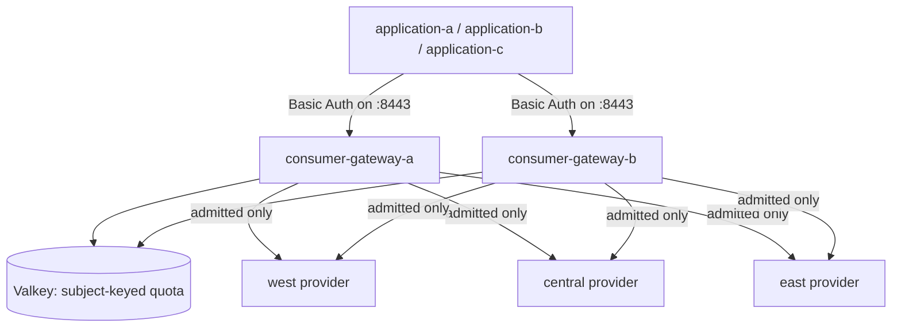

# Grid Distributed Quota Demo

This demo gives three applications independent token budgets while they share
one inference endpoint, two consumer gateway replicas, and one Grid provider
pool: `application-a`, `application-b`, and `application-c`.

Both gateways authenticate all three applications on port `8443`. Praxis
publishes the verified Basic Auth subject as typed, request-scoped
`AuthenticatedIdentity` metadata. The AI `token_rate_limit` filter uses
`key: authenticated_subject` to partition one Valkey-backed rule into an
independent bucket for each application.

No client-controlled identity header, identity gateway, projection filter,
trusted quota-group filter, or per-application listener is used.

## Architecture



The two gateway replicas use the same Valkey namespace and rule. The same
application therefore shares one budget across both replicas, while different
verified subjects receive independent buckets. The subject is hashed before it
is used in a backend key and is not exposed in logs or metrics.

Qualification evidence names the three fixed demo principals so reviewers can
audit isolation. These labels are test-fixture identifiers, not backend keys or
production telemetry; credentials and Authorization values are never recorded.

Quota admission happens before Grid routing. A denied request returns HTTP 429
without contacting a provider, and changing provider or region cannot create
quota.

## Quota Contract

The demo uses reservation-based hard admission:

| Setting | Value |
|---|---|
| Sliding window | 60 seconds |
| Capacity | 60 reserved tokens per application |
| Reservation | 15 tokens per request |
| Valkey namespace | `praxis:grid-token-rate-limit` |
| Rule | `per-application-budget` |
| Key source | `authenticated_subject` |

The reservation cap controls admission. Actual usage replaces the reservation
at settlement and may exceed the estimate; settled usage is evidence, not a
second hard cap. Soft enforcement is outside this demo.

## What It Proves

- Three credentials use one public endpoint and receive independent quotas.
- One application's budget is shared across both gateway replicas.
- Exhausting one application does not consume another application's budget.
- Invalid credentials neither reserve quota nor contact a provider.
- Admitted requests use the shared west, central, and east Grid provider pool.
- Concurrent admission does not exceed the reservation cap.
- Quota state survives a consumer restart and expires naturally.
- Valkey outage fails closed, and NetworkPolicy blocks unauthorized access.

## Prerequisites

- A local `praxis-proxy/grid` checkout containing the subject-keyed quota
  qualification runner. Set `GRID_REPO` if it is not at `../grid`.
- Compatible Praxis and AI revisions containing the typed Basic Auth identity
  producer and `token_rate_limit.key: authenticated_subject` consumer.
- Docker, Kind, kubectl, and Rust stable 1.96 or newer.
- Capacity for three single-node Kind clusters.

Basic Auth and token quota remain experimental optional features. Build the AI
image with:

```text
token-rate-limit-filter,praxis-filter/basic-auth-filter
```

Do not use an unrecorded Cargo path patch as image provenance. Version Praxis,
update AI to that released dependency, then build an immutable AI image. Grid
does not build or publish an AI rollup.

Build fresh `grid-operator`, `grid-overlay-sync`, and feature-enabled
`praxis-ai` images with the same immutable tag. The qualification loads those
images into Kind and must use `Never` so it cannot silently pull another image:

```bash
export IMAGE_TAG=distributed-quota-local
export GRID_XTASK_IMAGE_PULL_POLICY=Never
```

## Run

```bash
export GRID_REPO=/path/to/praxis-proxy/grid

./run.sh \
  --image-tag "$IMAGE_TAG" \
  --run-id quota-demo \
  --evidence-dir "$PWD/evidence-quota-demo"
```

`run.sh` builds Grid's Forge and xtask binaries, then runs
`run-grid-token-rate-limit-qualification` against this demo's `forge.yaml`.
That command deploys the Kind topology, executes the complete qualification,
writes `results.json` and `summary.txt`, and tears down by default. It is not a
deploy-only wrapper.

Use `--keep` only for intentional debugging. It leaves the Kind resources
running after the qualification; it does not skip the tests. `--run-id` is
optional and must be a lowercase DNS-safe value of at most 24 characters.

The credentials in this demo are disposable test values. Do not reuse them in
another environment. Evidence must not contain credentials, Authorization
values, the Valkey password, or kubeconfig contents.
